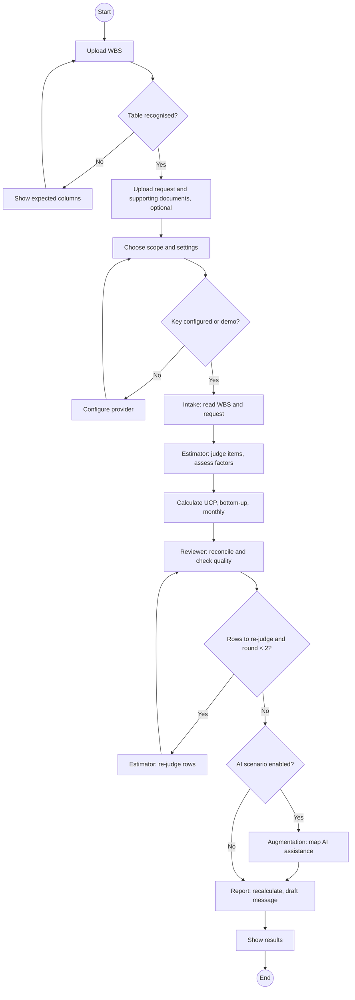
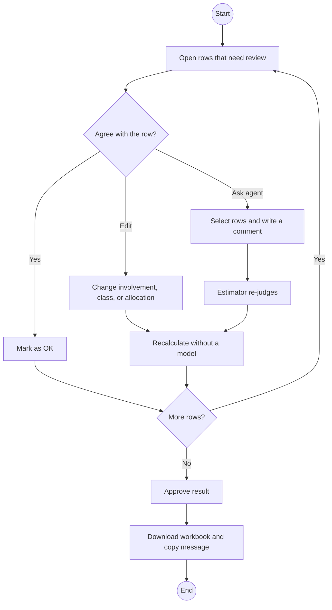

# Activity diagrams

## Validate a talent request

```mermaid
flowchart TD
    start((Start)) --> up[Upload WBS]
    up --> ok{Table recognised?}
    ok -- No --> fix[Show expected columns] --> up
    ok -- Yes --> docs[Upload request and supporting documents, optional]
    docs --> set[Choose scope and settings]
    set --> key{Key configured or demo?}
    key -- No --> cfg[Configure provider] --> set
    key -- Yes --> intake[Intake: read WBS and request]
    intake --> est[Estimator: judge items, assess factors]
    est --> calc[Calculate UCP, bottom-up, monthly]
    calc --> rev[Reviewer: reconcile and check quality]
    rev --> again{Rows to re-judge and round < 2?}
    again -- Yes --> rej[Estimator: re-judge rows] --> rev
    again -- No --> ai{AI scenario enabled?}
    ai -- Yes --> aug[Augmentation: map AI assistance] --> rep
    ai -- No --> rep[Report: recalculate, draft message]
    rep --> show[Show results]
    show --> stop((End))
```

## Review a result

```mermaid
flowchart TD
    a((Start)) --> b[Open rows that need review]
    b --> c{Agree with the row?}
    c -- Yes --> d[Mark as OK]
    c -- Edit --> e[Change involvement, class, or allocation]
    e --> f[Recalculate without a model]
    c -- Ask agent --> g[Select rows and write a comment]
    g --> h[Estimator re-judges] --> f
    d --> i{More rows?}
    f --> i
    i -- Yes --> b
    i -- No --> j[Approve result] --> k[Download workbook and copy message] --> l((End))
```
